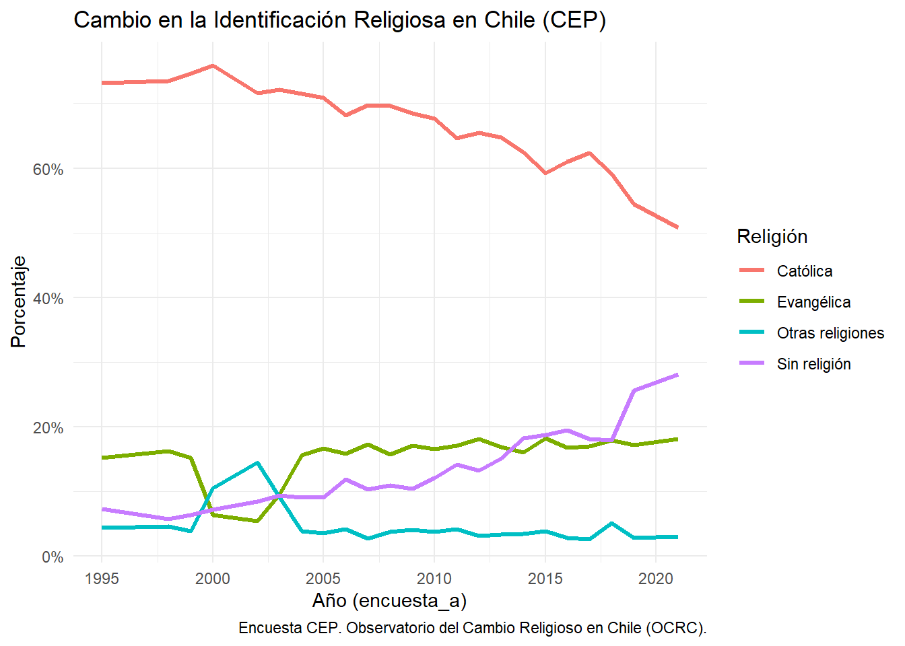
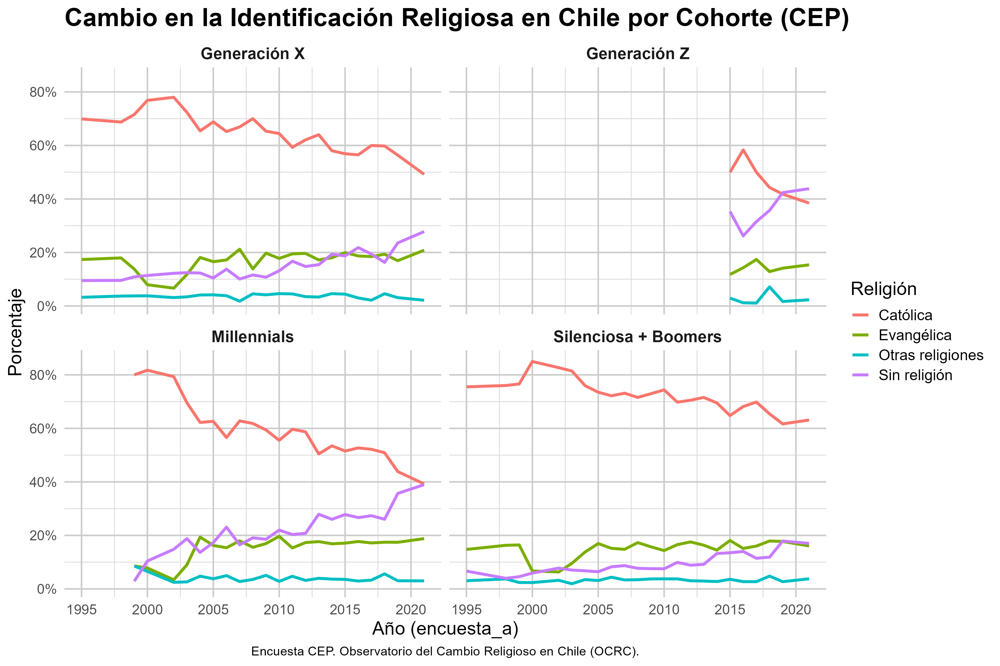
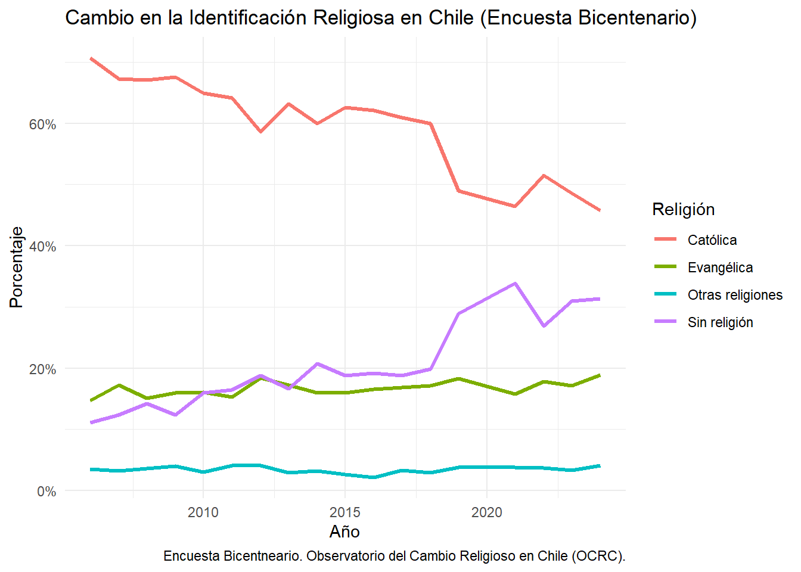
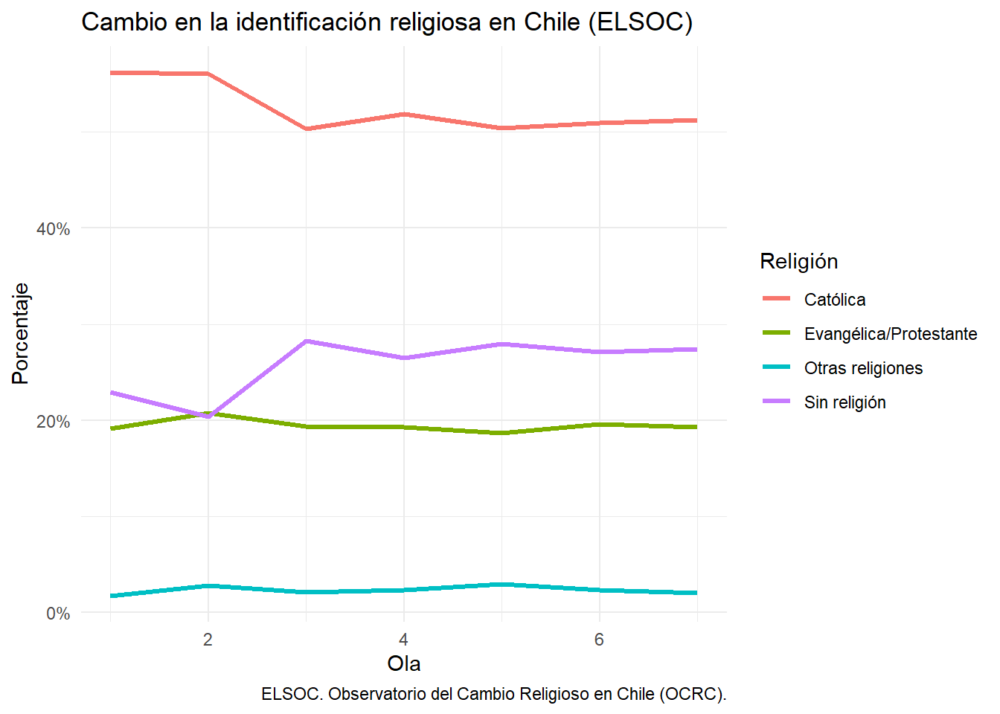

Esta sección constituye el núcleo del Observatorio del Cambio Religioso Chileno. Aquí se publican gráficos construidos a partir de las principales encuestas longitudinales disponibles en el país, junto con sus respectivas interpretaciones sustantivas.

El objetivo no es solo describir tendencias, sino ofrecer una lectura analítica del cambio religioso en Chile durante las últimas décadas, identificando transformaciones en la identificación religiosa, la práctica y las creencias.

El orden de presentación es el siguiente:

1. Encuesta CEP (Centro de Estudios Públicos)

2. Encuesta Bicentenario UC 

3. ELSOC (Estudio Longitudinal Social de Chile, COES)

En el futuro se incorporarán análisis comparados con otros países de América Latina y, eventualmente, análisis multinivel. Por ahora, el foco está puesto exclusivamente en la trayectoria chilena.

**Encuesta CEP (1994-20024)**

La Encuesta CEP es la serie de opinión pública más extensa disponible en Chile, con levantamientos periódicos desde la década de 1990. Su continuidad temporal permite observar con mayor precisión las transformaciones en la estructura religiosa del país

En este primer gráfico se presenta la evolución de la identificación religiosa declarada por los encuestados.

{fig-align="center" width="90%"}

*Fuente: Encuesta CEP. Observatorio del Cambio Religioso en Chile (OCRC).*

El gráfico evidencia una transformación profunda pero gradual en la estructura de identificación religiosa en Chile entre mediados de los años noventa y comienzos de la década de 2020.

En primer lugar, se observa una disminución sostenida de la identificación católica. A mediados de los noventa, cerca de siete de cada diez chilenos se declaraban católicos. A partir de los años 2000 comienza un descenso progresivo, con una caída más marcada después de 2015. Hacia el final del período, la proporción se sitúa en torno a la mitad de la población. El declive no es abrupto en sus primeras etapas, pero sí acumulativo y estructural.

En segundo lugar, la identificación evangélica muestra una notable estabilidad en el largo plazo. Tras una fluctuación puntual a comienzos de los 2000, la proporción se consolida en torno al 15–18%, sin evidenciar un crecimiento explosivo. Esto sugiere que el debilitamiento del catolicismo no se traduce automáticamente en una transferencia proporcional hacia el mundo evangélico.

El cambio más significativo ocurre en el grupo que declara no tener religión. Desde niveles cercanos al 6–7% en los años noventa, esta categoría aumenta de manera sostenida a partir de la década de 2000, con un salto particularmente visible en el período posterior a 2018. En los últimos años observados, la no afiliación se aproxima o supera el 25%, convirtiéndose en el segundo grupo más numeroso después del catolicismo.

Las “otras religiones” permanecen relativamente marginales y estables, lo que indica que el proceso no está marcado por una fuerte diversificación religiosa no cristiana, sino más bien por un crecimiento de la desafiliación.

En conjunto, el patrón observado sugiere que el cambio religioso chileno no se explica principalmente como una recomposición entre denominaciones cristianas, sino como un proceso de erosión de la identificación tradicional y expansión de la no afiliación. Más que un simple pluralismo, los datos apuntan hacia una reconfiguración del campo religioso donde la pérdida de centralidad institucional —especialmente del catolicismo— constituye el fenómeno dominante.

---

El cambio en la identificación religiosa en Chile no es homogéneo, sino con comportamiento particular marcado por la generación. Como se observa en la figura que se encuentra debajo, las distintas cohortes presentan trayectorias diferenciadas tanto en niveles como en ritmos de cambio.

En primer lugar, las cohortes más antiguas (Silenciosa + Boomers) muestran altos niveles de identificación católica a lo largo de todo el período, con una disminución moderada en el tiempo. En este grupo, la afiliación religiosa se mantiene relativamente estable y la proporción de personas sin religión crece de forma gradual, pero sin alcanzar niveles predominantes.

{fig-align="center" width="90%"}

*Fuente: Encuesta CEP. Observatorio del Cambio Religioso en Chile (OCRC).*

En contraste, las generaciones más jóvenes presentan un patrón distinto. Tanto en Millennials como en la Generación Z se observa un descenso más pronunciado del catolicismo, acompañado de un aumento sostenido de la población sin afiliación religiosa. Este proceso es especialmente visible en la Generación Z, donde en los años más recientes la proporción de personas sin religión iguala o incluso supera a la de católicos.

La Generación X ocupa una posición intermedia: si bien presenta niveles iniciales altos de identificación católica, muestra una tendencia clara de declive, junto con un aumento progresivo de la no afiliación. Esto sugiere que el cambio religioso no ocurre de manera abrupta, sino que se despliega gradualmente a través de las cohortes.

Por su parte, la identificación evangélica se mantiene relativamente estable en todas las generaciones, con variaciones menores en el tiempo. Esto indica que el crecimiento evangélico, observado en décadas anteriores, no sigue una lógica de expansión continua en las cohortes más recientes, sino más bien de estabilización.

En conjunto, estos resultados sugieren que el proceso de cambio religioso en Chile se explica en gran medida por un reemplazo generacional. Las nuevas cohortes no solo presentan menores niveles de identificación católica desde el inicio, sino que además muestran una mayor propensión a la no afiliación religiosa. De este modo, el declive agregado del catolicismo no responde únicamente a cambios individuales a lo largo del ciclo de vida, sino a diferencias estructurales entre generaciones.

---

**Encuesta Bicentenario UC**

Como indican en su página web (<https://encuestabicentenario.uc.cl/quienes-somos/>) la Encuesta Bicentenario es un proyecto de la Pontificia Universidad Católica de Chile, cuyo propósito es obtener información altamente confiable y sostenida en el tiempo acerca del estado de la sociedad chilena en tópicos relevantes y de alto impacto que permitan develar sus rasgos fundamentales.

Este estudio nació en el 2006 con la finalidad de conocer lo que pensaban los chilenos de cara al Bicentenario. Desde entonces se ha mantenido año tras año, lo que ha permitido contar con información estadística relevante por más de una década.

Para la presente página se trabaja con una versión no oficial que juntó las bases de todos los años. Para poder acceder a ella se puede desacargar desde el repositorio de la página en el perfil de GitHub. 

{fig-align="center" width="90%"}

*Fuente: Encuesta Bicentenario. Observatorio del Cambio Religioso en Chile (OCRC).*

El gráfico muestra la evolución de la identificación religiosa en Chile a partir de las distintas olas de la Encuesta Bicentenario, permitiendo observar los cambios ocurridos desde mediados de los años 2000 hasta comienzos de la década de 2020.

En primer lugar, se aprecia una disminución sostenida de la identificación católica. A mediados de los años 2000, cerca de dos tercios de la población se declaraban católicos. Durante la década siguiente el descenso es gradual, con fluctuaciones menores pero una tendencia claramente negativa. A partir de fines de la década de 2010 la caída se vuelve más pronunciada, situándose en torno al 45–50% en los últimos años observados. El patrón general confirma una pérdida persistente de centralidad del catolicismo en la estructura religiosa del país.

En segundo lugar, la identificación evangélica muestra una notable estabilidad en el tiempo. Desde el inicio del período analizado, la proporción de personas que se declaran evangélicas se mantiene en torno al 15–18%, con variaciones relativamente acotadas entre años. Al igual que en otras fuentes de datos, esto sugiere que el debilitamiento del catolicismo no se traduce necesariamente en un crecimiento equivalente del mundo evangélico, cuyo tamaño parece mantenerse relativamente constante en el agregado nacional.

El cambio más significativo se observa en el grupo que declara no tener religión. A mediados de los años 2000 esta categoría se situaba en torno al 10–12% de la población, pero comienza a aumentar de manera sostenida durante la década siguiente. El incremento se vuelve particularmente visible a partir de la segunda mitad de la década de 2010, alcanzando niveles cercanos o superiores al 30% en los últimos años del período. De este modo, la no afiliación religiosa pasa a constituirse en el segundo grupo más numeroso después del catolicismo.

Por su parte, las “otras religiones” mantienen una presencia relativamente baja y estable a lo largo del tiempo, generalmente por debajo del 5% de la población. Esto indica que el cambio religioso en Chile no está asociado principalmente a una diversificación significativa hacia tradiciones religiosas minoritarias.

En conjunto, el patrón observado es consistente con el identificado en otras encuestas nacionales: el cambio religioso en Chile se caracteriza principalmente por la disminución de la identificación católica y el crecimiento sostenido de la no afiliación. Más que un proceso de recomposición entre denominaciones cristianas, los datos sugieren una transformación más profunda del campo religioso, marcada por la pérdida de centralidad de las instituciones tradicionales y la expansión de identidades religiosas más débiles o inexistentes.

---

**ELSOC (Estudio Longitudinal Social de Chile, COES)**

El Estudio Longitudinal Social de Chile (ELSOC) fue una encuesta realizada de forma anual a la población urbana chilena desde el 2016 hasta el 2023. Como bien señalan en su página web (<https://conferencias.coes.cl/encuesta-panel/>) el fin de deicha herramienta era evaluar la manera cómo piensan, sienten y se comportan los chilenos en torno a un conjunto de temas referidos al conflicto y la cohesión social en el país.

{fig-align="center" width="90%"}

*Fuente: Encuesta ELSOC. Observatorio del Cambio Religioso en Chile (OCRC).*

El gráfico basado en ELSOC permite observar la evolución de la identificación religiosa en Chile a partir de un diseño longitudinal, siguiendo a los mismos individuos a lo largo de siete olas. Esto introduce una diferencia fundamental respecto a encuestas transversales: los cambios observados reflejan, en mayor medida, transformaciones reales en las trayectorias individuales y no solo reemplazos generacionales.

En primer lugar, la identificación católica muestra una disminución relevante entre las primeras olas del panel, pasando de niveles cercanos al 55% a aproximadamente un 50%. Posteriormente, la serie se estabiliza, manteniéndose en torno a ese nivel hasta el final del período. Este patrón sugiere que el debilitamiento del catolicismo ocurre con mayor intensidad en una fase inicial, seguido de una cierta consolidación.

En segundo lugar, la identificación evangélica/protestante se mantiene notablemente estable a lo largo de todas las olas, fluctuando levemente en torno al 19–20%. Al igual que en los datos del CEP, esto indica que el cambio religioso no se explica principalmente por un traspaso masivo desde el catolicismo hacia otras denominaciones cristianas.

En tercer lugar, el grupo sin religión presenta un aumento significativo entre las primeras olas, pasando de aproximadamente un 23% a cerca de un 28%. A partir de ese punto, la proporción se estabiliza con leves fluctuaciones. Este comportamiento sugiere que una parte importante del proceso de desafiliación ocurre relativamente temprano en el período observado.

Las “otras religiones” permanecen en niveles bajos y estables, sin evidenciar un crecimiento sostenido.

En conjunto, el patrón longitudinal refuerza la interpretación de que el cambio religioso en Chile está marcado por procesos de desafiliación más que por recomposición denominacional. Dado que se sigue a los mismos individuos en el tiempo, estos resultados sugieren que el aumento de la no afiliación no es únicamente un fenómeno generacional, sino que también responde a cambios en la identificación religiosa a lo largo del ciclo de vida.

Más ampliamente, los datos apuntan a un proceso de reconfiguración del campo religioso en el cual la pérdida de centralidad del catolicismo se combina con una expansión de posiciones de no afiliación relativamente estables, una vez que estas se adoptan.

---
