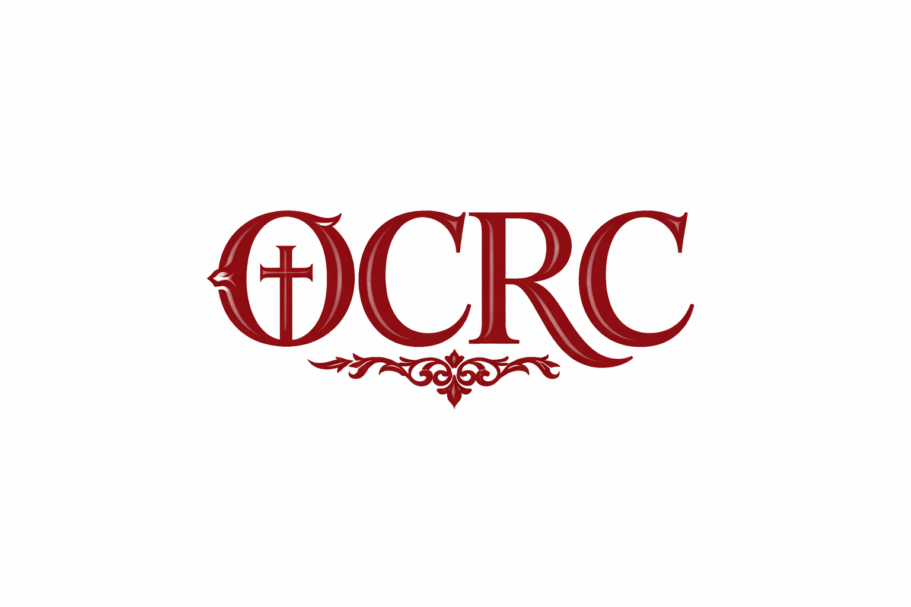

  

Plataforma abierta de análisis y visualización de datos sobre identificación religiosa, afiliación y transformación cultural en Chile.

Este proyecto reúne indicadores, series temporales, bases de datos y recursos orientados a la investigación académica, el análisis público y el trabajo periodístico.

## Líneas de trabajo

- Series históricas de identificación religiosa
- Análisis generacional (Edad–Período–Cohorte)
- Transformación del catolicismo, evangelismo y no afiliación
- Datos abiertos y código reproducible

---

### Dirección

**Ramón Jara López**  
Sociólogo y Mg. en Sociología, Pontificia Universidad Católica de Chile  
Investigador

---

Proyecto iniciado el 11 de febrero de 2026, festividad de Nuestra Señora de Lourdes.
